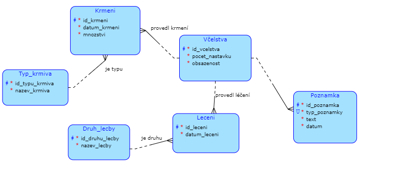

Téma semestrální práce
=======================

## **Klientská bussiness operace**

Klient si bude moci přidávat nová vlastní včelstva a sestavovat si reálnou kopii určitého stanoviště. Ke každému včelstvu si bude moci zapisovat vlastní poznámky, například jestli včelstvo má královnu, kolik vyprodukovali medu atd., a záznamy o léčení a krmení daného včelstva.

## **Datový model serverové části**

Takto vypadá datový model naší databáze, N:M vazba se nachází mezi entitami Leceni a Druh_lecby.

## **Komplexní dotaz**

Komplexní dotaz by samozřejmě mohlo vypadat např. Jaké druhy léčení byly použity u určitého včelstva. Obdobný dotaz by mohl být na typy krmiva.
